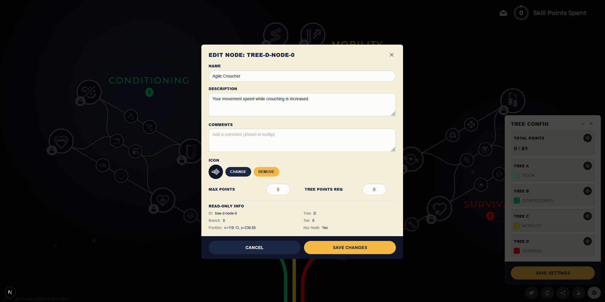

# Skill Tree Planner

An interactive skill tree planner for the game Arc Raiders™ built with React, Next.js, TypeScript, Tailwind CSS, and Framer Motion.

*This is a fan-made project and is not affiliated with Embark Studios.*



## Features

- **Interactive Skill Trees**: Two separate skill trees (Tree A and Tree B) with multiple branches
- **Visual States**: Skills display as locked, available, or unlocked with distinct visual styles
- **Smooth Animations**: Powered by Framer Motion for engaging interactions
- **Smart Prerequisites**: Skills can only be unlocked when prerequisites are met (supports both AND/OR logic)
- **URL-based Sharing**: Share your skill builds via compact URLs - no account needed!
- **Automatic URL Updates**: Your build is encoded in the URL and updates as you make changes
- **Responsive Design**: Works on desktop and mobile devices
- **Real-time Tooltips**: Hover over skills to see detailed information
- **Path Highlighting**: Connection paths animate based on unlock status

## Tech Stack

- **Next.js 15** - React framework with App Router
- **TypeScript** - Type-safe development
- **Tailwind CSS** - Utility-first styling
- **Framer Motion** - Animation library
- **SVGR** - SVG to React component conversion

## Getting Started

### Prerequisites

- Node.js 18+
- npm or yarn
- Python 3.x (for SVG processing scripts)

### Installation

1. Clone the repository
2. Install dependencies:

```bash
npm install
```

3. Set up environment variables (optional, for edit mode):

Create a `.env.local` file and add:

```bash
NEXT_PUBLIC_ENABLE_EDIT_MODE=true
```

4. Run the development server:

```bash
npm run dev
```

5. Open [http://localhost:3000](http://localhost:3000) in your browser

## Project Structure

```
skill-tree-planner/
├── app/                      # Next.js app directory
│   ├── layout.tsx           # Root layout with SkillProvider
│   └── page.tsx             # Main page
├── components/              # React components
│   ├── SkillTree.tsx        # Main skill tree component
│   ├── SkillNode.tsx        # Individual skill node
│   └── SkillTooltip.tsx     # Hover tooltip
├── context/                 # React context
│   └── SkillContext.tsx     # Global state management
├── data/                    # Data files
│   └── skillData.ts         # Skill definitions & mappings
├── types/                   # TypeScript types
│   ├── skills.ts            # Skill-related interfaces
│   └── svg.d.ts             # SVG module declarations
├── assets/                  # SVG source files (processed by webpack)
│   └── ARtreeforweb.svg     # Skill tree SVG
└── public/                  # Public static assets
    └── resources/           # Game resources
        └── icons/           # PNG skill icons
```

## Customization

### Adding New Skills

Adding new skills requires local development setup and running processing scripts. Follow these steps:

#### Prerequisites
- Python 3.x installed locally
- `.env.local` file with edit mode enabled:

  Create a `.env.local` file and add:

  ```bash
  NEXT_PUBLIC_ENABLE_EDIT_MODE=true
  ```

#### Steps to Add a New Skill

1. **Enable Edit Mode**: Start the development server with edit mode enabled:
   ```bash
   npm run dev
   ```
   The edit mode button will appear in the bottom toolbar when running on `localhost` in development mode.

2. **Modify the SVG**: Update `assets/ArcRaidersTree.svg` with your new skill node. Ensure:
   - Nodes are named with the pattern: "Tree X node Y-Z"
   - Paths are named with the pattern: "Tree X path ..."
   - Update coordinates and connections as needed

3. **Run Processing Scripts**: Process the updated SVG to extract data:
   ```bash
   # On Windows
   .\scripts\update.bat
   
   # On macOS/Linux
   ./scripts/update.sh
   ```
   This will update container positions and generate necessary data files.

4. **Use Edit Mode UI**: 
   - Click the "EDIT" button in the bottom toolbar
   - Use the skill editor to add/modify skill properties
   - Changes are saved to `data/config.json` and related files

5. **Update Skill Data**: If needed, manually edit `data/skillData.ts` for any additional properties not covered by the UI.

**Note**: Edit mode only works on `localhost` in development environment with `NEXT_PUBLIC_ENABLE_EDIT_MODE=true`.

### Modifying the SVG

Replace `assets/ARtreeforweb.svg` with your custom SVG. Ensure:

- Nodes are named with the pattern: "Tree X node Y-Z"
- Paths are named with the pattern: "Tree X path ..."
- Update coordinates in `skillData.ts` to match
- The SVG is placed in the `assets/` folder (not `public/`) so webpack can process it via SVGR

### Adding PNG Icons

1. Place PNG icons in `public/resources/icons/`
2. Update skill nodes in `skillData.ts` with `iconPath: '/resources/icons/your-icon.png'`

### Styling

Modify Tailwind classes in components or update `app/globals.css` for global styles.

## Deployment to Vercel

### Option 1: Deploy via Git

1. Push your code to GitHub
2. Import the repository in [Vercel](https://vercel.com)
3. Vercel will auto-detect Next.js and deploy

### Option 2: Deploy via CLI

```bash
npm install -g vercel
vercel
```

Follow the prompts to deploy.

### Environment Variables

**Development:**
- `NEXT_PUBLIC_ENABLE_EDIT_MODE=true` - Enables skill editing UI (only works on localhost in development)

**Production:**
No environment variables are required for basic deployment.

## Build Commands

```bash
# Development server
npm run dev

# Production build
npm run build

# Start production server
npm start

# Lint code
npm run lint
```

## State Management

The app uses React Context API for global state with URL-based persistence:

- **Unlocked Skills**: Set of unlocked skill IDs encoded in the URL
- **Hovered Skill**: Currently hovered skill for tooltips
- **URL Encoding**: Uses compact base64 encoding with bitset compression
- **Automatic Updates**: URL updates in real-time as you unlock/lock skills
- **Share Button**: One-click copy of shareable URL to clipboard

### How URL Sharing Works

1. **Make your build**: Click on skills to unlock them
2. **Click "Share Build"**: Copies the URL to your clipboard
3. **Share the URL**: Anyone with the link will see your exact skill selection
4. **URL Format**: `https://yoursite.com/?build=ABC123...`

The encoding is highly efficient:
- Uses bitset compression (1 bit per skill)
- Base64 URL-safe encoding
- Example: 10 unlocked skills ≈ 10 characters in URL

## Browser Support

- Chrome/Edge (latest)
- Firefox (latest)
- Safari (latest)
- Mobile browsers (iOS Safari, Chrome Mobile)

## License

MIT

## Contributing

Contributions welcome! Please open an issue or submit a pull request.

## Credits

Built with modern web technologies and best practices for interactive game UIs.
